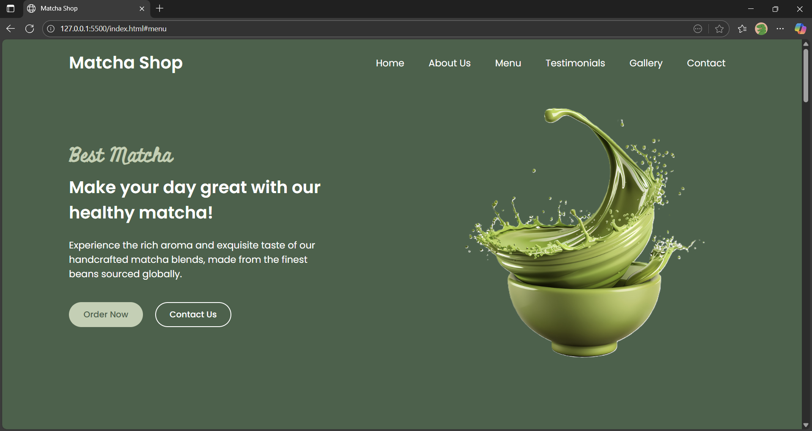

# ☕ Matcha Shop

A modern, responsive website for **Matcha Shop**, a coffee shop offering premium coffee and delicious food items. Built using **HTML**, **CSS**, and **JavaScript**, this template includes all essential sections for a professional online presence.

---

## Features

- **Responsive Design** — Works seamlessly on desktop, tablet, and mobile.
- **Sections Included**:
  - Home (Hero section with CTA)
  - About Us (Story & highlights)
  - Menu (Latte, Ice-cream, cake items)
  - Testimonials (Customer feedback carousel)
  - Gallery (Visual showcase)
  - Contact Us (Form + location info)
  - Footer (Links & social media)
- **Interactive Elements**:
  - Mobile navigation toggle
  - Sliding testimonials carousel
- **Accessibility**:
  - Semantic HTML tags
  - ARIA attributes for navigation and carousel
  - Keyboard-friendly interactions

---

## 📸 Screenshots

### Home 


---


## 🛠 Tech Stack

- **HTML5** — Semantic structure
- **CSS3** — Responsive layout with Grid & Flexbox
- **JavaScript (Vanilla)** — Interactivity and DOM manipulation

---

## How to Run

1. Clone the repository:
   ```bash
   git clone https://github.com/chamika-u/matcha-shop
   ```

2. Navigate to the project folder:
    ```bash
    cd matcha-shop
    ```

3. Open index.html in your browser.
    Optional: Use Live Server in VS Code or npx serve for local development.

---

### 👋 Made with ❤️ by **chamika-u**

> If you enjoyed this project, ⭐ star the repo and share your feedback!  
> Let’s brew more ideas together ☕

---


